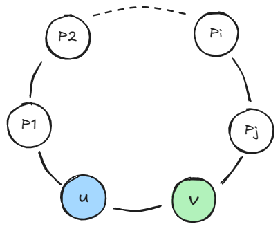

+++
title = '环路检测'
date = 2024-09-20T14:18:44+08:00
draft = false
categories = ["算法", "图论"]

+++



**环路检测**算法用于判断无向图中环的存在并保存环的信息。

环路检测算法主要是通过一次遍历点集，找到是否访问到已经访问过的点，来记录已经形成的环路信息。

给定点集，我们从任意一个点出发，将所有点的深度记为 \\(0\\) 并把当前点的深度记为 \\(1\\)，进行一次 \\(\texttt{DFS}\\) ，将路径上访问到的点的深度都进行一次更新。

判断是否已经成了环，就是在遍历的过程中当前点的相邻点的深度已经被更新过了，说明已经回到了已经访问过的点，有可能会成环，如下图所示：



上图中 \\(u\\) 和 \\(v\\)，假如访问顺序为 \\(v\to P_j\to P_i\to\cdots\to P_2\to P_1\to u\\)，则此时 \\(u\\) 的深度大于 \\(v\\) 的深度，说明形成了环。

```cpp
void dfs(int u, int pre) // u 为当前访问的点，pre 为上一个访问的点
{
    f[u] = pre, dep[u] = dep[pre] + 1; // 更新当前点的父亲节点 f[u] 和深度 dep[u]
    for (auto v : g[u]) { // 遍历 u 的相邻点
        if (v == pre) { // 跳过访问父亲节点
			continue;
        }
        if (dep[v]) { // 相邻点已经访问过
			cycle(u, v); // 求所在环的信息
        } else {
			dfs(v, u); // 继续访问下一个点
        }
    }
}
void solve()
{
	for (int i = 1; i <= n; i++) {
        if (!dep[i]) { // 可能一次 dfs 访问不完所有点
			dfs(i, 0);
        }
    }
}
```

现在来求环的信息。虽然在访问已经被更新过路径的点的时候求环的信息，但是可能会出现递归回溯的时候重复访问，例如：上图中访问点 \\(v\\) 的时候，先递归地遍历 \\(v\to P_j\\) 的方向，再遍历 \\(v\to P_i\\)，此时对于 \\(v\\) 来说 \\(u\\) 已经被访问过了，会重复求环的信息，因此需要排除`dep[u] < dep[v]`的情况。

```cpp
void cycle (int u,int v){
    if (dep[u] < dep[v]) { // 不访问回溯时已经访问过的子节点
		return;
    }
    cnt ++; // 更新当前环的编号
    res[cnt].push_back(v); // 将环上的点保存
    while (u != v) {
        res[cnt].push_back(u);
        u = f[u]; // u 只要一直往上找就能回到 v
    }
};
```

