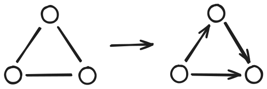

+++
title = '三元环计数'
date = 2024-08-30T10:31:21+08:00
draft = false
categories = ["算法", "图论"]

+++



**三元环计数**是图论中一个比较重要的问题，用于求解无向图中三元环的个数。

**三元环**指的是简单图 \\(G\\) 中的一个无序三元组 \\((u,v,w)\\)，满足存在三条边连接 \\(u,v,w\\) 三个点。

三元环可以看作某种意义上的**等价关系**，即满足自反性、对称性和传递性，如果考虑传递性，则每个三元环的三条边均看作有向重边，在代码实现上如果三种传递性都要验证，时间复杂度会很高。

因此我们可以考虑将三元环的无向图转换为有向图，这样只需要验证一种关系的传递性即可。我们假设：

- 有向边从**度数小**的边指向**度数大**的边
- 度数相同，有向边从**下标小**的边指向**下标大**的边

很容易证明证明没有环的存在，因为如果存在环，必定会出现度数大的指向度数小的边的情况（环的首尾）。此时的图为一张**有向无环图**（DAG）。



因此将无向图转换为有单向边的有向无环图，每次遍历 \\(u\\) 的相邻点 \\(v\\)，然后验证与 \\(v\\) 的相邻点 \\(w\\) 是否存在一条有向边即可。此时 \\(w\\) 也作为 \\(u\\) 的相邻点存在，遍历 \\(u\\) 的相邻点时判断一下就可以了。

## 1. 代码



```cpp
void solve()
{
    int n, m;
    std::cin >> n >> m; // 输入节点数 n 和边数 m
    
    std::vector<int> degree(n + 1), g[n + 1]; // 定义度数和邻接表
    std::vector<std::pair<int, int>> op(m + 1); // 定义原始边的关系
    
    for (int i = 1; i <= m; i++) { // 输入边的信息
        int u, v;
        std::cin>> u >> v;
        if (u > v) { // 保证从下标小的指向下标大的
            std::swap(u, v);
        }
        op[i] = {u, v};
        degree[u]++, degree[v]++;
    }
    
    for (int i = 1; i <= m; i++) { // 保证从度数小的指向度数大的
        auto &[u, v] = op[i];
        if (degree[u] > degree[v]) {
            std::swap(u, v);
        }
        g[u].push_back(v);
    }
    
    std::vector<int> vis(n + 1); // 定义是否访问
    int num = 0; // 定义三元环的个数
    
    for (int i = 1; i <= n; i++) {
        for (auto &j : g[i]) {
            vis[j] = 1;
        }
        for (auto &j : g[i]) { // 等价关系的传递性
            for (auto &k : g[j]) {
                if (vis[k]) {
                    num++;
                }
            }
        }
        for (auto &j : g[i]) {
            vis[j] = 0;
        }
    }
    std::cout << num;
}
```



## 2. 时间复杂度

由于将每条无向边都转换为了有向边，导致每个点的度数为不超过 \\(\sqrt{m}\\)，因此遍历总的时间复杂度为 \\(O(m\log m)\\)。
