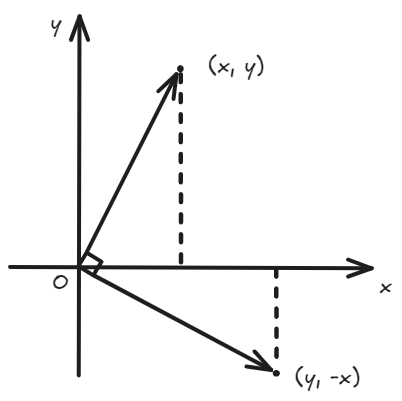

+++
title = '2019 CCPC 秦皇岛站 - A'
date = 2024-09-18T23:07:30+08:00
draft = false
series = ["2019 CCPC 秦皇岛站"]
series_order = 1
showSummary = false
tags = ["极角排序"]
categories = ["比赛", "区域赛"]

+++



## 1. 题目



Given \\(n\\) points \\(P_1, P_2, \cdots, P_n\\) on 2D plane and \\(q\\) queries. In \\(i\\)\-th query, a point \\(A_i\\) is given, and you should determine the number of tuples \\((u, v)\\) that \\(1 \le u \lt v \le n\\) and \\(A_i, P_u, P_v\\) form a non-degenerate right-angled triangle.

***<u>Input</u>***

The first line contains two positive integers \\(n,q~(2\le n \le 2\,000, 1\le q \le 2\,000)\\), denoting the number of given points and the number of queries.

Next \\(n\\) lines each contains two integers \\(x_i, y_i~(|x_i|,|y_i| \le 10^9)\\), denoting a given point \\(P_i\\).

Next \\(q\\) lines each contains two integers \\(x_i, y_i~(|x_i|,|y_i| \le 10^9)\\), denoting a query point \\(A_i\\).

It is guaranteed that the input \\(n+q\\) points are all pairwise distinct.

***<u>Output</u>***

Output \\(q\\) lines each contains a non-negative integer, denoting the answer to corresponding query.



<br>



有 \\(n\\) 个点，进行 \\(q\\) 次询问，每次询问给出一个点 \\(A\\)，输出与 \\(A\\) 能组成直角三角形的点组合的个数。



## 2. 思路

最暴力的方式就是求出所给点两两之间的向量，然后再求点 \\(A\\) 和每个点的向量，比较有多少个向量对点积为 \\(0\\)。然而时间复杂度为 \\(O(n^2 + q\cdot (n + n\cdot n^2))\\)，时间复杂度相当高，显然暴力是完全不可取的。

重新审视这个题，我们发现确实需要使用**向量点积为零**来判断是否存在直角。根据向量的**平移不变性**，我们可以将向量平移到原点形成“菊花图”，这样转化为关于原点的角度计算问题。

关于向量 \\(\vec{i} = (x,y)\\)，其实可以看做一条从原点出发，到点 \\((x,y)\\) 的一条向量。由于点积只需要考虑向量方向的问题，所以我们可以将向量的长度为最小。为了避免出现浮点数，我们有如下的公式：
$$
\vec{i} = (\frac{x}{\gcd(x, y)}, \frac{y}{\gcd(x, y)})
$$
同时方便处理，我们可以将所有的向量的第一维变为正数，转移到第一、四象限来解决。此时我们就会发现，向量之间如果成垂直关系，那么会有如下图的坐标变换关系：



对于含点 \\(A\\) 的直角三角形，要么 \\(A\\) 作为顶点，要么 \\(A\\) 不作为顶点。而对于在图上的向量，有两种可能的情况：\\(\overrightarrow{X_iX_j}\\) 和 \\(\overrightarrow{AX_k}\\)

- 若 \\(A\\) 不为顶点，则判断是否存在 \\(\overrightarrow{X_1X_2}\cdot\overrightarrow{AX_1} = 0\\) 或 \\(\overrightarrow{X_1X_2}\cdot\overrightarrow{AX_2} = 0\\)。
- 若 \\(A\\) 为顶点，则判断是否存在 \\(\overrightarrow{AX_1}\cdot\overrightarrow{AX_2} = 0\\)。

因此只需要判断有多少对向量的坐标满足上图的坐标变换关系即可。

值得注意的是，有可能会出现 \\(\overrightarrow{X_1X_2}\cdot\overrightarrow{AX_3} = 0\\) 的情况，因此可以先保存每个 \\(X_i\\) 所连的向量都有哪些，每计算一个 \\(\overrightarrow{AX_i}\\) 都与 \\(X_i\\) 所连的向量相比较再计算，然后再把所有 \\(A_i\\) 放在一起比较。

## 3. 代码



```cpp
void solve()
{
    int n, q;
    std::cin >> n >> q;
    std::vector<std::pair<int, int>> p(n);
    for (int i = 0; i < n; i++) {
        int x, y;
        std::cin >> x >> y;
        p[i] = {x, y};
    }
    std::vector<std::vector<std::pair<int, int>>> check(n);
    std::pair<int, int> res;
    auto vec = [&](std::pair<int, int> p1, std::pair<int, int> p2) {
        std::pair<int, int> ans;
        auto [x1, y1] = p1;
        auto [x2, y2] = p2;
        if (x1 < x2) {
            std::swap(x1, x2);
            std::swap(y1, y2);
        }
        int x0 = x1 - x2, y0 = y1 - y2;
        int mu = std::abs(std::__gcd(x0, y0));
        if (y0 == 0) {
            ans = {1, 0};
        } else if (x0 == 0) {
            ans = {0, 1};
        } else {
            ans = {x0 / mu, y0 / mu};
        }
        return ans;
    };
    for (int i = 0; i < n; i++) {
        for (int j = 0; j < n; j++) {
            if (i == j) {
                continue;
            }
            res = vec(p[i], p[j]);
            check[i].push_back(res);
        }
        std::sort(check[i].begin(), check[i].end());
    }
    while (q--) {
        int xa, ya, num = 0;
        std::cin >> xa >> ya;
        std::vector<std::pair<int, int>> tmp;
        for (int i = 0; i < n; i++) {
            res = vec({xa, ya}, p[i]);
            tmp.push_back(res);
            auto &[u, v] = res;
            std::pair<int, int> p1 = {-v, u}, p2 = {v, -u};
            num += std::upper_bound(check[i].begin(), check[i].end(), p1) - std::lower_bound(check[i].begin(), check[i].end(), p1);
            num += std::upper_bound(check[i].begin(), check[i].end(), p2) - std::lower_bound(check[i].begin(), check[i].end(), p2);
        }
        std::sort(tmp.begin(), tmp.end());
        for (auto &[x, y] : tmp) {
            std::pair<int, int> p = {-y, x};
            num += std::upper_bound(tmp.begin(), tmp.end(), p) - std::lower_bound(tmp.begin(), tmp.end(), p);
        }
        std::cout << num << "\n";
    }
}
```



## 4. 总结

本题考查的知识点运用了类似**极角排序**的思想，将所有的向量放到原点附近，然后按照极角顺序扫描所有向量，找到是否有成 \\\(90\degree\\) 的组合存在。

此外，在代码中还存在许多值得注意的地方：

- 使用 `vector<vector<pair<int, int>>>` 代替 `vector<map<pair<int, int>, int>>`，因为 `map` 每次插入删除都会引入 \\(\log{n}\\) 的时间复杂度，而搭配 `sort` 和 `upper_bound` 与 `lower_bound` 得到区间符合要求的向量对数能很好地降低时间复杂度。
- 还有种做法是将内外循环对换，使得访问一个 `map` \\(q\\) 次，避免对 `map` 重复访问产生的不必要的开销。
- 注意负半轴变为正半轴是 \\((-y,x)\\)，而正半轴变为负半轴是 \\((y,-x)\\)。
